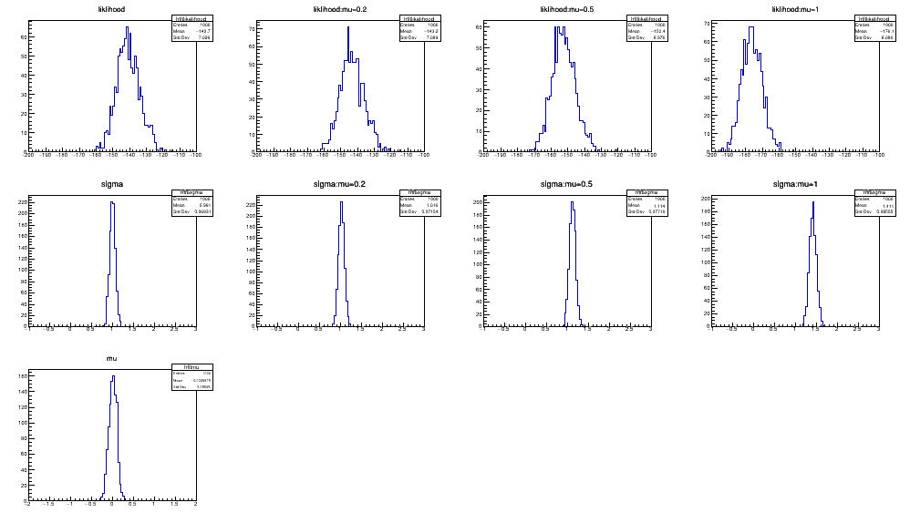
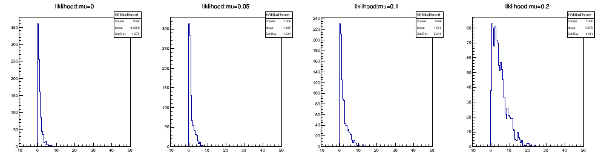

# TMinuit, likelihood, profile likelihood
## fitGaus.C
+ TMinuit拟合
+ 产生了一个1000组数据，每组数据中包含100个高斯分布的数据，存入了root文件中,保证每次运行不用反复产生，同时保证数据一致性。对应函数`generateData()`
+ 分别对每组数据拟合，得到对应的拟合值：`likelihood`,`sigma`分布,对于非固定的`mu`，给出了`mu`的分布。可以看出随mu与真实值差距越来越大，likelihood的值
会变大

## profileGaus.C
+ TMinuit拟合;**没有找到怎么从`RooABSReal`中获得单个点对应`likelihood`的方法**,tutorial只翻到了能够绘制整个区间上的likelihood，但是目标是提取
0，0.05，0.1，0.2处的likelihood值，并对1000组数据画出分布，最后没有找到对应方法。
+ **利用之前的**1000组数据，每组数据中包含100个高斯分布的数据
+ 分别对每组数据拟合，得到对应的拟合值：`qu`分布,可以看到分布在变宽，同时均值也在增大

